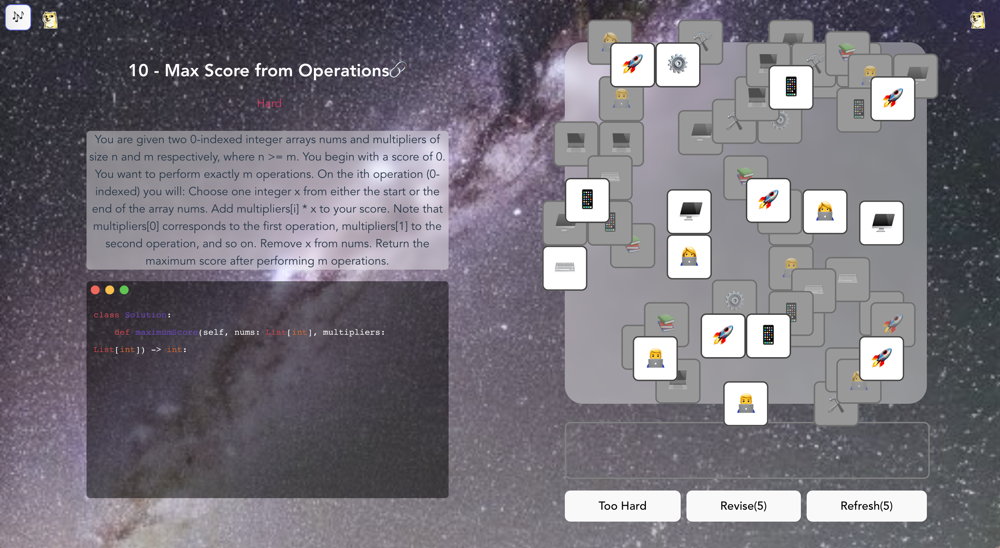
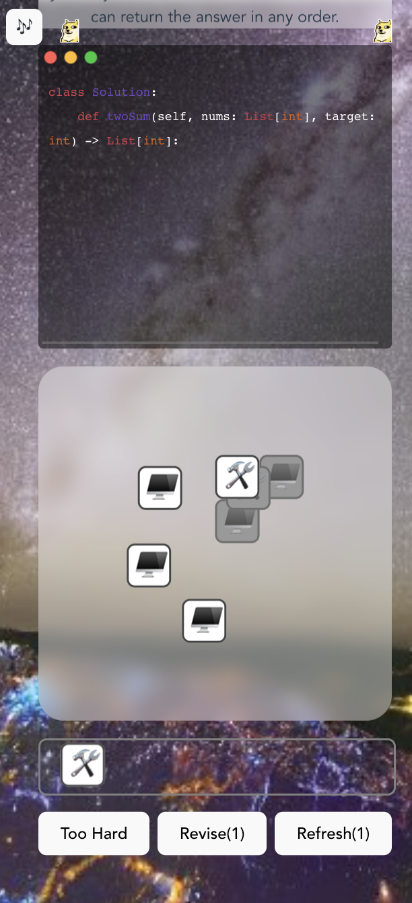

## Happy Triple Elimation: Programming Algorithm
> Tempest(tar118@pitt.edu)

A game to teach players what is algorithm practise looks like.
A Match 3 casual game.
Hope you enjoy the HAPPY ELIMINATING and learn some algorithm knowledge.

### Players

-   Everyone who is interested in programming!
-   Everyone who is obsessed in happy eliminating, finding the triplet!s

### Purpose

#### Transform

Through this game, you may learn how to solve algorithm problems in programming, and feel how difficult it is to solve them.

#### Barriers

Players may be not interested in algorithm, programming and triplet eliminating.

#### Game Impact

The happiness players feel

(maybe the spread on social network) 

### Scenarios

Players find the triple same elements in a space structure to eliminate them with limited stack to store extra elements.

In this process, there is a window to show the code panel and also teach players some useful programming knowledge to solve questions.

### Features & TODO
- [x] Body: using this finding triple icons game to solve the problem and learn algorithm
- [x] Genetate the Puzzle with Spatial Structure
- [x] A background generated by Stable Diffusion
- [x] The Audio for clicking and eliminating
- [x] Background music and dancing gif
- [x] Items: Refresh and Revision, to help players pass
- [x] Triple Match reward, a refresh or a revision chance
- [x] Complete codes with player's progress to eliminate triplets
- [x] Display the problem description and code panel.
- [x] Display the problem tag. 
- [x] Winner: winner popup modal animation to show you wined
- [x] Failure: fail popup modal animation to show you failed
- [x] Endless Mode: After first 10 levels, players can choose endless mode to enjoy happy eliminating game. There are at most 100 levels.
- [x] Support mobile devices
- [x] Configurable levels information and expandability 
- [ ] Vivid dialogs to show the scenario before start
- [ ] Switch different scenarios
- [ ] Gold System
- [ ] Task system to earn gold
- [ ] Shops to buy more items
- [ ] More Animations

### Demo

[Video Demo Link](https://drive.google.com/file/d/1MHUcxK6A5LOsq9obJqb8Fv3CSnoNsoR6/view?usp=sharing)

### License

MIT

